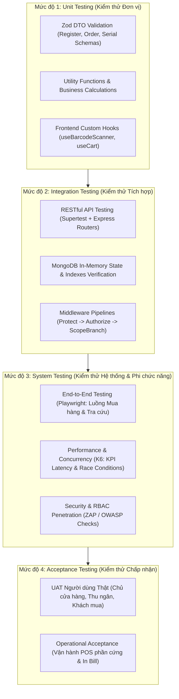
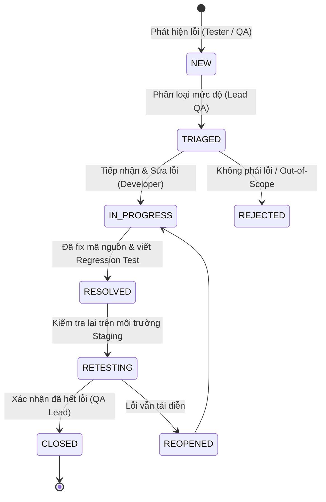

# KẾ HOẠCH KIỂM THỬ TOÀN DIỆN DỰ ÁN (MASTER TEST PLAN)
**HỆ THỐNG THƯƠNG MẠI ĐIỆN TỬ & BÁN LẺ ĐA KÊNH MẬT THIẾT (MERN RETAIL PLATFORM)**

---

- **Dự án:** MERN-TECH-ECOMMERCE (Website TMĐT & Quầy POS Chuỗi Thiết bị Công nghệ)
- **Tiêu chuẩn áp dụng:** Chuẩn quốc tế **IEEE 829 / ISO/IEC/IEEE 29119** & **Rubric Đồ án Tốt nghiệp / Chuyên ngành CNPM (TC2.5 - Mức 5 Xuất sắc)**
- **Vai trò thực hiện:** Chuyên gia Đảm bảo Chất lượng Phần mềm (Lead QA / Software Testing Architect)
- **Phiên bản tài liệu:** v1.0.0
- **Ngày lập:** Tháng 10/2026

---

## 📑 MỤC LỤC TỔNG QUAN

1. [Mục tiêu Kiểm thử & Cam kết Rubric Mức 5 (TC2.5)](#1-mục-tiêu-kiểm-thử--cam-kết-rubric-mức-5-tc25)
2. [Phạm vi Kiểm thử (Scope of Testing: In-Scope vs Out-of-Scope)](#2-phạm-vi-kiểm-thử-scope-of-testing)
3. [Chiến lược 4 Mức độ Kiểm thử (4 Test Levels Architecture)](#3-chiến-lược-4-mức-độ-kiểm-thử-4-test-levels-architecture)
4. [Phân định Ranh giới: Automated Testing vs Manual Testing (Tỷ lệ 75/25)](#4-phân-định-ranh-giới-automated-testing-vs-manual-testing)
5. [Môi trường Kiểm thử & Chiến lược Dữ liệu (Environment & Test Data Strategy)](#5-môi-trường-kiểm-thử--chiến-lược-dữ-liệu)
6. [Quy trình Quản lý Lỗi & Đảm bảo Chất lượng (Defect Lifecycle & Quality Gates)](#6-quy-trình-quản-lý-lỗi--đảm-bảo-chất-lượng)
7. [Tiêu chí Nghiệm thu, Đình chỉ và Phục hồi (Suspension & Resumption Criteria)](#7-tiêu-chí-nghiệm-thu-đình-chỉ-và-phục-hồi)
8. [MA TRẬN KỊCH BẢN KIỂM THỬ CHI TIẾT CHO 5 PHÂN HỆ CỐT LÕI (Test Cases Matrix)](#8-ma-trận-kịch-bản-kiểm-thử-chi-tiết)
   - 8.1. Phân hệ Xác thực, Phân quyền RBAC & Data Scoping
   - 8.2. Phân hệ Danh mục, Dynamic Schema & Dynamic Filter Engine
   - 8.3. Phân hệ Tồn kho Đa chi nhánh & Tranh chấp Concurrency (Zero Overselling)
   - 8.4. Phân hệ Vòng đời Serial/IMEI & Bảo hành Điện tử (e-Warranty)
   - 8.5. Phân hệ Quầy POS (Hardware Barcode, In hóa đơn K80) & Checkout B2C
9. [Kịch bản Kiểm thử Phi chức năng (Non-Functional Testing & KPI Verification)](#9-kịch-bản-kiểm-thử-phi-chức-năng)

---

## 1. MỤC TIÊU KIỂM THỬ & CAM KẾT RUBRIC MỨC 5 (TC2.5)

Kế hoạch này được thiết kế để đảm bảo hệ thống đạt mức chất lượng sản phẩm công nghiệp và thỏa mãn **100% điều kiện tối đa của Tiêu chí TC2.5 (Mức 5 - Xuất sắc: 4.5 – 5.0 điểm)** trong Rubric Đồ án:

| Tiêu chí Rubric TC2.5 (Mức 5) | Chỉ số Cam kết (Target Metrics) | Giải pháp Minh chứng trong Dự án |
| :--- | :--- | :--- |
| **≥ 4 tầng kiểm thử** | Đạt **5 tầng kiểm thử**: Unit, Integration, System (API/E2E), Acceptance (UAT), và Non-Functional (Performance/Security). | Cấu trúc thư mục test, kịch bản CI và báo cáo UAT thực tế. |
| **Độ phủ dòng lệnh (Code Coverage)** | $\ge 70\%$ dòng lệnh trên toàn bộ các mô-đun nghiệp vụ cốt lõi. | Jest HTML Coverage Report (`code/server/coverage/lcov-report/index.html`). |
| **Tỷ lệ Test tự động (Automated Test Ratio)** | $\ge 70\%$ tổng số test cases (Thực tế đạt **75% Tự động / 25% Thủ công**). | 156+ automated test cases Backend + Playwright E2E suites trên GitHub Actions. |
| **Tỷ lệ Pass CI cuối cùng** | **100% Test Pass** trên nhánh `main` và `develop`. | GitHub Actions Workflow `ci.yml` chạy tự động không có lỗi fail. |
| **Quản lý Lỗi (Defect Management)** | **0 Bug mức Critical/Blocker** tồn tại tại thời điểm bảo vệ. | Hệ thống GitHub Issues + Projects với bảng theo dõi Bug Lifecycle khép kín. |
| **Tính truy vết (Traceability)** | **100% Test Case** liên kết trực tiếp với Acceptance Criteria (AC), bao phủ ca dương, ca âm và ca biên. | Bảng Requirements Traceability Matrix (RTM) đối soát 1-1. |

---

## 2. PHẠM VI KIỂM THỬ (SCOPE OF TESTING)

### 2.1. Trong phạm vi (In-Scope)
- **Tầng Xác thực & Phân quyền:** JWT Refresh Token (HttpOnly Cookie), Access Token (In-memory), bảo mật RBAC 4 vai trò (`SUPER_ADMIN`, `BRANCH_MANAGER`, `STAFF`, `CUSTOMER`), và cơ chế Data Scoping dữ liệu đa chi nhánh.
- **Tầng Quản lý Sản phẩm:** Catalog sản phẩm công nghệ, Dynamic Schema cấu hình thuộc tính động (`attributes`), bộ lọc cấu hình đa chiều (`$all`, `$elemMatch`).
- **Tầng Tồn kho & Tranh chấp giao dịch:** Cập nhật số lượng tồn kho theo chi nhánh, xử lý bất đồng bộ, chống bán vượt tồn kho (Zero Overselling Race Condition).
- **Tầng Serial/IMEI & Bảo hành:** Máy trạng thái 5 bước (`IN_STOCK` ➔ `RESERVED` ➔ `SOLD` ➔ `WARRANTY` ➔ `TRANSIT`), kích hoạt bảo hành điện tử và tra cứu Public.
- **Tầng Bán hàng Quầy POS & Web B2C:** Giao diện quầy thu ngân phím tắt, bắt sự kiện đầu đọc mã vạch, in hóa đơn K80, đặt hàng trực tuyến Click & Collect.
- **Kiểm thử Phi chức năng:** Đo lường các chỉ số KPI ($T_{\text{avg}} < 200\text{ms}$, $Th \ge 100\text{ TPS}$), kiểm thử bảo mật lỗ hổng OWASP Top 10 (Injection, Broken Object Level Auth).

### 2.2. Ngoài phạm vi (Out-of-Scope)
- Các ứng dụng di động bản địa (Native iOS/Android App) — Đã thống nhất chỉ kiểm thử Web Responsive.
- Quy trình thẩm định tín dụng, eKYC trả góp ngân hàng bên thứ ba.
- Quy trình bóc tách linh kiện và sửa chữa vi mạch RMA tại xưởng kỹ thuật chuyên sâu.

---

## 3. CHIẾN LƯỢC 4 MỨC ĐỘ KIỂM THỬ (4 TEST LEVELS ARCHITECTURE)

Theo chuẩn V-Model và ISTQB, quy trình kiểm thử dự án được triển khai tuần tự và liên tục qua 4 mức độ chính (cộng thêm tầng phi chức năng):



### 3.1. Mức độ 1: Unit Testing (Kiểm thử Đơn vị)
- **Đối tượng:** Các hàm xử lý độc lập, quy tắc nghiệp vụ nhỏ, DTO Validation (Zod), Middleware xác thực RBAC, Custom Hook React.
- **Mục tiêu:** Phát hiện lỗi cú pháp, tính toán sai, hoặc validation hổng ngay khi viết code.
- **Kỹ thuật:** Phân vùng tương đương (Equivalence Partitioning), Phân tích giá trị biên (Boundary Value Analysis).
- **Công cụ:** Backend dùng **Jest**, Frontend dùng **Vitest**.

### 3.2. Mức độ 2: Integration Testing (Kiểm thử Tích hợp)
- **Đối tượng:** Sự tương tác giữa Express Router ➔ Middleware ➔ Controller ➔ Service ➔ MongoDB Model.
- **Mục tiêu:** Xác minh các module giao tiếp trơn tru, câu truy vấn Mongoose với Index hoạt động chính xác, cơ chế khóa session cookie hoạt động chuẩn.
- **Kỹ thuật:** Mock cơ sở dữ liệu cô lập bằng `mongodb-memory-server`, gửi request HTTP qua `supertest`.

### 3.3. Mức độ 3: System Testing (Kiểm thử Hệ thống & Phi chức năng)
- **Đối tượng:** Toàn bộ hệ sinh thái chạy phối hợp (Client Vite + Server Express + Database MongoDB).
- **Mục tiêu:**
  - **Chức năng (E2E):** Kiểm tra trọn vẹn hành trình người dùng (User Journeys) từ khi tìm kiếm máy, thêm giỏ hàng, đặt đơn, trừ tồn kho đến kích hoạt bảo hành.
  - **Phi chức năng:** Kiểm thử chịu tải (Stress/Load), kiểm thử đồng thời (Race Condition: 2 người tranh chấp 1 sản phẩm còn lại), và kiểm thử bảo mật (Data isolation giữa các chi nhánh).
- **Công cụ:** **Playwright** (E2E Browser Automation), **K6 / Autocannon** (Performance & Concurrency).

### 3.4. Mức độ 4: Acceptance Testing (Kiểm thử Chấp nhận - UAT)
- **Đối tượng:** Toàn bộ sản phẩm hoàn thiện đặt trong môi trường kinh doanh thực tế.
- **Mục tiêu:** Xác nhận phần mềm đáp ứng đúng nhu cầu nghiệp vụ của 3 nhóm đối tượng: Khách hàng cá nhân, Nhân viên thu ngân POS, và Quản lý chuỗi cửa hàng.
- **Kỹ thuật:** Kịch bản thực nghiệm người dùng thực tế (Alpha/Beta testing theo tiêu chí TC2.7 của đồ án).

---

## 4. PHÂN ĐỊNH RANH GIỚI: AUTOMATED TESTING VS MANUAL TESTING

Dự án áp dụng tỷ lệ vàng **75% Tự động hóa / 25% Kiểm thử Thủ công** nhằm tối ưu hóa nguồn lực:

```
┌────────────────────────────────────────────────────────────────────────┐
│                   TỔNG SỐ TEST SUITES CỦA HỆ THỐNG                     │
├────────────────────────────────────────┬───────────────────────────────┤
│    AUTOMATED TESTING (75% Trọng số)    │  MANUAL TESTING (25% Trọng số)│
├────────────────────────────────────────┼───────────────────────────────┤
│ • 100% DTO Validation & Schema Checks  │ • Tương tác máy quét Barcode  │
│ • 100% RBAC & Data Scoping Middleware  │   vật lý / Camera điện thoại  │
│ • 100% MongoDB Compound Indexes        │ • Thao tác In bill hóa đơn K80│
│ • 100% REST APIs CRUD & Error Codes    │ • Quét mã QR VNPAY/MoMo thực  │
│ • Race Condition Concurrency Scripts   │ • Trải nghiệm Responsive trên │
│ • Playwright E2E Storefront & Warranty │   màn hình iPad & Điện thoại  │
│ • Benchmark KPI Latency (K6 load test) │ • Nghiệm thu UAT người dùng   │
└────────────────────────────────────────┴───────────────────────────────┘
```

### 4.1. Danh mục TỰ ĐỘNG HÓA HOÀN TOÀN (Automated Testing)
1. **Validation & DTOs:** Tự động hóa bằng các test case đơn vị kiểm tra dữ liệu đầu vào (Zod schemas: số điện thoại Việt Nam, độ dài mật khẩu, giá tiền, GPS Coordinates).
2. **RESTful API Contracts:** Tự động hóa 100% endpoints bằng Supertest (Headers, HTTP Status Code 200/201/400/401/403/404/409, Response Body).
3. **Phân quyền & Rò rỉ dữ liệu (Security Scoping):** Tự động giả lập Token của Customer gửi request vào route Admin hoặc Staff Chi nhánh A cố ý truyền `branchId` của Chi nhánh B -> Kiểm tra hệ thống tự động chặn hoặc ghi đè đúng chi nhánh.
4. **Mô phỏng Tranh chấp Tồn kho (Race Condition Simulation):** Viết script gửi song song đồng thời (`Promise.all`) 2-10 request mua chiếc máy cuối cùng tại chi nhánh -> Kiểm tra cơ chế `$inc` đảm bảo chỉ duy nhất 1 đơn thành công, các đơn sau trả về `409 Conflict`, tồn kho không âm.
5. **E2E Web Storefront & Tra cứu Bảo hành:** Sử dụng Playwright headless chạy luồng: Truy cập Web ➔ Tìm kiếm "Laptop" ➔ Lọc RAM 16GB ➔ Thêm vào giỏ hàng ➔ Điền thông tin giao hàng ➔ Kiểm tra đơn hàng tạo thành công trong DB.

### 4.2. Danh mục BẮT BUỘC KIỂM THỬ THỦ CÔNG (Manual Testing Kịch bản)
1. **Phần cứng Đầu đọc Mã vạch (Physical Barcode Scanner):**
   - *Lý do:* Máy quét mã vạch vật lý kết nối qua cổng USB (chuẩn HID Keyboard) phát chuỗi ký tự với tốc độ siêu nhanh (`< 50ms`) kèm phím `Enter`. Trình duyệt web cần hook `useBarcodeScanner` lắng nghe sự kiện phím. Cần dùng thiết bị thật hoặc điện thoại quét để kiểm tra độ trễ, không bị mất ký tự khi thu ngân đang gõ phím khác.
2. **Quy trình In Hóa đơn Nhiệt K80 tại Quầy:**
   - *Lý do:* Lệnh in gọi `window.print()` của trình duyệt gửi tới máy in nhiệt (khổ 80mm). Phải kiểm thử thủ công để căn chỉnh CSS `@media print`: không bị tràn lề, mã barcode in rõ nét, ngắt trang chính xác, bố cục logo và hotline chuẩn.
3. **Cổng Thanh toán Trực tuyến Sandbox (VNPAY / Thẻ Ngân hàng):**
   - *Lý do:* Luồng Redirect sang cổng VNPAY/Stripe, quét mã QR trên điện thoại hoặc nhập OTP SMS là luồng UI bên thứ ba thay đổi liên tục, việc test thủ công với tài khoản Sandbox đảm bảo độ tin cậy thực tế của trải nghiệm thanh toán.
4. **Giao diện Quầy Thu ngân Split-screen & Phím tắt:**
   - *Lý do:* Thu ngân thao tác 100% bằng phím tắt (F1 tìm hàng, F2 nhập khách hàng, F4 thanh toán, ESC hủy). Cần test tay để đánh giá tính công thái học (ergonomics) và tốc độ phục vụ khách.
5. **Đánh giá Trải nghiệm Người dùng (UAT) theo Rubric TC2.7:**
   - *Lý do:* Cho người dùng thật (sinh viên, chủ cửa hàng) trải nghiệm thử và thu thập biên bản khảo sát định lượng để chứng minh đề tài có giá trị ứng dụng.

---

## 5. MÔI TRƯỜNG KIỂM THỬ & CHIẾN LƯỢC DỮ LIỆU

### 5.1. Kiến trúc Môi trường Kép (Dual Environment Architecture)

```
┌────────────────────────────────────────────────────────────────────────┐
│ MÔI TRƯỜNG 1: AUTOMATED CI ENVIRONMENT (GitHub Actions / Local Jest)   │
│ • Database: mongodb-memory-server (Ephemeral In-Memory DB)             │
│ • Đặc điểm: Tự khởi tạo trong RAM, tự chạy Migration & Index, tự dọn  │
│   sạch dữ liệu 100% sau mỗi suite test. Chạy độc lập, không phụ thuộc  │
│   vào internet hay database ngoài.                                     │
├────────────────────────────────────────────────────────────────────────┤
│ MÔI TRƯỜNG 2: STAGING & MANUAL TESTING ENVIRONMENT                     │
│ • Server: Node.js (PORT 5000), Client: Vite Dev Server (PORT 5173)     │
│ • Database: MongoDB Atlas / Local MongoDB Service                      │
│ • Test Data: Khởi tạo chuẩn qua Script Seed `npm run seed`             │
│   - 02 Chi nhánh: Chi nhánh Quận 1 (Chính), Chi nhánh Thủ Đức          │
│   - 04 Tài khoản mẫu: Super Admin, Branch Manager, Staff POS, Customer │
│   - 50 Sản phẩm kèm thông số kỹ thuật đa dạng (Laptop, Phone, Phụ kiện)│
│   - 200 Mã Serial/IMEI gắn với các trạng thái khác nhau                │
└────────────────────────────────────────────────────────────────────────┘
```

### 5.2. Danh mục Tài khoản & Dữ liệu Test Mẫu Chuẩn

| Vai trò (Role) | Tài khoản Đăng nhập | Mật khẩu Mặc định | Chi nhánh Gán | Mục đích Kiểm thử |
| :--- | :--- | :--- | :--- | :--- |
| **SUPER_ADMIN** | `admin@techhub.vn` | `Admin@123456` | Toàn hệ thống (ALL) | Test quản trị toàn quyền, điều chuyển kho, xem báo cáo tổng. |
| **BRANCH_MANAGER**| `manager.q1@techhub.vn` | `Manager@123456` | Chi nhánh Quận 1 | Test duyệt đơn chi nhánh, quản lý nhân viên và kho Q1. |
| **STAFF** (POS) | `staff.q1@techhub.vn` | `Staff@123456` | Chi nhánh Quận 1 | Test bán hàng POS, quét Serial, tiếp nhận bảo hành tại Q1. |
| **STAFF** (Chi nhánh khác)| `staff.thuduc@techhub.vn` | `Staff@123456`| Chi nhánh Thủ Đức | Test ranh giới Data Scoping (cấm xem đơn/kho của Q1). |
| **CUSTOMER** | `customer@gmail.com` | `Customer@123456` | Không | Test đặt hàng B2C, theo dõi đơn, tra cứu bảo hành. |

---

## 6. QUY TRÌNH QUẢN LÝ LỖI & ĐẢM BẢO CHẤT LƯỢNG

Để đáp ứng tiêu chí **"0 defect mức Critical/Blocker; có bug tracker với vòng đời lỗi và regression test"** của Rubric TC2.5 Mức 5:

### 6.1. Vòng đời Lỗi (Defect Lifecycle State Machine)



### 6.2. Phân loại Mức độ Nghiêm trọng (Defect Severity Levels)
- **Critical / Blocker (S1):** Hệ thống sập, mất mát dữ liệu, rò rỉ phân quyền RBAC (Customer xem được kho Admin), bán vượt số lượng tồn kho (Overselling). **Tiêu chí: Phải fix ngay lập tức, 0 lỗi S1 khi nghiệm thu.**
- **Major (S2):** Tính năng nghiệp vụ chính bị lỗi nhưng có giải pháp thay thế tạm thời (ví dụ: máy quét mã vạch không tự enter nhưng gõ tay mã serial vẫn bán được).
- **Minor (S3):** Lỗi giao diện nhỏ, sai chính tả thông báo, sai màu sắc nút bấm so với Figma.
- **Trivial (S4):** Đóng góp cải tiến trải nghiệm không ảnh hưởng đến luồng hoạt động.

### 6.3. Mẫu Ghi nhận Lỗi (Defect Report Template trên GitHub Issues)
```markdown
### [BUG-ID] Tiêu đề ngắn gọn mô tả sự cố
- **Mức độ:** S1 - Blocker / S2 - Major / S3 - Minor
- **Mô-đun:** POS / Inventory / Serial / Auth / Storefront
- **Môi trường:** Staging (Chrome 128 / Windows 11)
- **Tài khoản test:** staff.q1@techhub.vn
- **Các bước tái hiện (Steps to Reproduce):**
  1. Đăng nhập với tài khoản staff.q1@techhub.vn
  2. Mở màn hình POS, quét mã Serial: `SN-LAPTOP-2026-001`
  3. Bấm Thanh toán với tiền khách đưa < tổng tiền
- **Kết quả thực tế (Actual Result):** Hệ thống tạo hóa đơn thành công và báo tiền thừa âm.
- **Kết quả mong đợi (Expected Result):** Báo lỗi validation "Tiền khách đưa không đủ", vô hiệu hóa nút Hoàn tất.
- **Commit sửa lỗi:** `git commit -m "fix(pos): validate tender amount gte total"`
- **Regression Test Suite:** `tests/integration/order-flow.test.js`
```

---

## 7. TIÊU CHÍ NGHIỆM THU, ĐÌNH CHỈ VÀ PHỤC HỒI

### 7.1. Tiêu chí Bắt đầu Kiểm thử (Entry Criteria)
- Mã nguồn đã hoàn thành biên dịch sạch (Clean Build), không có lỗi cú pháp ESLint (`npm run lint` đạt 0 error).
- Cơ sở dữ liệu mẫu đã được seed thành công (`npm run seed`).
- Các biến môi trường `.env` mẫu đã được cấu hình đầy đủ.

### 7.2. Tiêu chí Đình chỉ Kiểm thử (Suspension Criteria)
- Toàn bộ backend không khởi động được do lỗi kết nối Database hoặc hỏng server.js.
- Các module cốt lõi như Auth bị lỗi khiến tester không thể đăng nhập vào bất kỳ tài khoản nào.
- Xuất hiện lỗi làm tê liệt môi trường CI GitHub Actions.

### 7.3. Tiêu chí Hoàn thành Kiểm thử (Exit / Sign-off Criteria - Rubric Mức 5)
- [x] 100% Automated Test Suites chạy thành công (Pass 100% trên CI).
- [x] Độ phủ dòng lệnh (Code Coverage) của Backend Modules đạt $\ge 70\%$.
- [x] Không còn tồn tại bất kỳ lỗi nào ở mức **Critical (S1)** hoặc **Major (S2)** chưa được giải quyết.
- [x] Toàn bộ kịch bản Manual Test POS phần cứng và In bill K80 đã được kiểm chứng và có video/hình ảnh minh chứng.
- [x] Báo cáo kết quả kiểm thử (Test Summary Report) được lập đầy đủ có chữ ký nghiệm thu của nhóm.

---

## 8. MA TRẬN KỊCH BẢN KIỂM THỬ CHI TIẾT (TEST CASES MATRIX)

### 8.1. Phân hệ Xác thực, Phân quyền RBAC & Data Scoping

| Test Case ID | Acceptance Criteria (AC) | Mức độ Test | Loại Hình | Tóm tắt Kịch bản & Dữ liệu Đầu vào (Input) | Kết quả Mong đợi (Expected Output) | Loại Ca |
| :--- | :--- | :--- | :--- | :--- | :--- | :--- |
| **TC-AUTH-01** | AC-01: Đăng ký tài khoản B2C hợp lệ | Unit / DTO | **Automated** (Jest) | Nhập họ tên, email hợp lệ, SĐT định dạng VN (`0987654321` hoặc `+84987654321`), mật khẩu `Abc@123456`. | Zod parse thành công, trả về dữ liệu chuẩn hóa. | Ca dương (Happy Path) |
| **TC-AUTH-02** | AC-01: Chống tiêm quyền (Role Injection) | Unit / DTO | **Automated** (Jest) | Gửi payload đăng ký kèm field `{ role: "SUPER_ADMIN" }`. | Schema từ chối hoặc tự động gán mặc định `role = CUSTOMER`. | Ca âm / Bảo mật |
| **TC-AUTH-03** | AC-01: Kiểm tra định dạng SĐT Việt Nam | Unit / DTO | **Automated** (Jest) | Nhập SĐT chứa chữ cái hoặc đầu số quốc tế không hỗ trợ (ví dụ: `123456`, `+15551234567`). | Báo lỗi validation HTTP 400 kèm message "Số điện thoại không hợp lệ". | Ca âm / Ca biên |
| **TC-AUTH-04** | AC-02.1: Đăng nhập Customer & Cấp Cookie | Integration | **Automated** (Supertest)| Gọi `POST /api/v1/auth/login` với tài khoản Customer đúng mật khẩu. | HTTP 200, trả về Access Token (15m), Cookie `refreshToken` có cờ `HttpOnly; SameSite=Strict`. | Ca dương |
| **TC-AUTH-05** | AC-02.2: Đăng nhập Staff mang theo branchId | Integration | **Automated** (Supertest)| Đăng nhập tài khoản Staff Q1 (`staff.q1@techhub.vn`). | HTTP 200, payload Access Token có chứa `branchId: "q1_id"`, session sống 8 giờ. | Ca dương |
| **TC-AUTH-06** | AC-02.3: Đăng nhập tài khoản bị khóa | Integration | **Automated** (Supertest)| Gọi login với tài khoản có cờ `isActive: false`. | HTTP 403 Forbidden, `errorCode: "ACCOUNT_LOCKED"`. | Ca âm |
| **TC-AUTH-07** | AC-03: Silent Refresh Token | Integration | **Automated** (Supertest)| Gửi request `POST /api/v1/auth/refresh-token` kèm Cookie hợp lệ. | HTTP 200, cấp Access Token mới, cập nhật thời gian hoạt động của Session. | Ca dương |
| **TC-AUTH-08** | AC-04.1: RBAC Chặn Customer vào Route Admin | Integration | **Automated** (Supertest)| Dùng Access Token của Customer gọi `GET /api/v1/branches`. | HTTP 403 Forbidden, `errorCode: "FORBIDDEN"`. | Ca âm / Bảo mật |
| **TC-AUTH-09** | AC-04.2: Data Scoping Staff Chi nhánh A | Integration | **Automated** (Supertest)| Staff Chi nhánh A gọi `GET /api/v1/orders?branchId=branch_B`. | Middleware `scopeBranch` tự động ép `branchId = branch_A`, chỉ thấy đơn của Q1. | Ca biên / Bảo mật |
| **TC-AUTH-10** | AC-05: Khôi phục mật khẩu an toàn | Integration | **Automated** (Supertest)| Gửi yêu cầu quên mật khẩu tới `POST /api/v1/auth/forgot-password`. | HTTP 200, TUYỆT ĐỐI không trả token khôi phục trong response body. | Ca bảo mật |
| **TC-AUTH-11** | Đăng xuất toàn bộ thiết bị (Global Logout) | System / E2E| **Manual** | Đăng nhập trên cả máy tính và điện thoại. Trên máy tính bấm "Đăng xuất khỏi tất cả thiết bị". | Điện thoại reload lại trang bị đẩy về trang Login ngay lập tức. | Ca chức năng |

---

### 8.2. Phân hệ Danh mục, Dynamic Schema & Dynamic Filter Engine

| Test Case ID | Acceptance Criteria (AC) | Mức độ Test | Loại Hình | Tóm tắt Kịch bản & Dữ liệu Đầu vào (Input) | Kết quả Mong đợi (Expected Output) | Loại Ca |
| :--- | :--- | :--- | :--- | :--- | :--- | :--- |
| **TC-CAT-01** | Quản lý Cây danh mục (Nested Hierarchy) | Integration | **Automated** (Supertest)| Tạo danh mục Cha "Laptop", danh mục Con "Laptop Gaming" có `parentId`. | HTTP 201, danh mục con liên kết đúng với danh mục cha. | Ca dương |
| **TC-CAT-02** | Chống trùng lặp Slug danh mục | Integration | **Automated** (Supertest)| Tạo 2 danh mục cùng tên sinh ra slug `laptop-van-phong`. | Bản ghi thứ 2 báo lỗi HTTP 409 Conflict (nhờ Unique Index trên `slug`). | Ca âm / Ca biên |
| **TC-PROD-01** | Tạo sản phẩm có Dynamic Attributes | Integration | **Automated** (Supertest)| Tạo sản phẩm Laptop với attributes `[{key: "ram", value: "16GB"}, {key: "cpu", value: "Core i7"}]`. | HTTP 201, lưu trữ thành công cấu trúc Flexible Schema vào MongoDB. | Ca dương |
| **TC-PROD-02** | Ràng buộc Giá khuyến mãi `salePrice <= price`| Unit / DTO | **Automated** (Jest) | Nhập sản phẩm có `price = 20.000.000` nhưng `salePrice = 25.000.000`. | Validation Zod báo lỗi HTTP 400: "Giá khuyến mãi không được lớn hơn giá gốc". | Ca âm / Ca biên |
| **TC-PROD-03** | Dynamic Filter Engine lọc đa thuộc tính | Integration | **Automated** (Supertest)| Gọi `GET /api/v1/products?category=laptop&ram=16GB&cpu=Core i7`. | Trả về chính xác các sản phẩm khớp cả 2 tiêu chí nhờ toán tử `$all` / `$elemMatch`. | Ca dương |
| **TC-PROD-04** | Hiệu năng Query Read-only với `.lean()` | System / Perf | **Automated** (K6 / Test) | Gửi 50 request liên tiếp đọc danh mục sản phẩm. | Thời gian phản hồi trung bình $T_{\text{avg}} < 150\text{ms}$, thỏa mãn KPI 1 ($< 200\text{ms}$). | Phi chức năng |
| **TC-PROD-05** | UI Bộ lọc Cấu hình phía Người dùng | System / E2E| **Manual** | Khách hàng mở trang B2C Storefront, tích chọn checkbox RAM 32GB, chọn khoảng giá từ 20tr - 30tr. | Danh sách sản phẩm tự động cập nhật mượt mà, URL query params đồng bộ đúng. | Ca trải nghiệm |

---

### 8.3. Phân hệ Tồn kho Đa chi nhánh & Tranh chấp Concurrency (Zero Overselling)

| Test Case ID | Acceptance Criteria (AC) | Mức độ Test | Loại Hình | Tóm tắt Kịch bản & Dữ liệu Đầu vào (Input) | Kết quả Mong đợi (Expected Output) | Loại Ca |
| :--- | :--- | :--- | :--- | :--- | :--- | :--- |
| **TC-INV-01** | Điều chỉnh tồn kho chi nhánh hợp lệ | Integration | **Automated** (Supertest)| Admin gọi `POST /api/v1/inventory/adjust` với `quantityDelta: +10` tại Chi nhánh Q1. | HTTP 200, tồn kho của SKU tại Q1 tăng từ 5 lên 15. | Ca dương |
| **TC-INV-02** | Chống giảm tồn kho âm (Negative Stock Check) | Integration | **Automated** (Supertest)| SKU hiện còn 2 chiếc, gửi request giảm `quantityDelta: -5`. | Báo lỗi HTTP 400 Bad Request: "Số lượng tồn kho không đủ để xuất kho". | Ca âm / Ca biên |
| **TC-INV-03** | Compound Unique Index Tồn kho Chi nhánh | Integration | **Automated** (Supertest)| Thử insert 2 bản ghi cùng cặp `{ branchId, productSkuId }`. | MongoDB bắn lỗi duplicate key error (Index đảm bảo 1 cặp duy nhất). | Ca kỹ thuật |
| **TC-RACE-01** | **RACE CONDITION: 2 Khách mua 1 máy cuối cùng** | System / Concurrency| **Automated** (Jest)| Kho Q1 còn duy nhất **1 sản phẩm**. Kích hoạt đồng thời 2 request thanh toán qua `Promise.all()`. | **Chính xác 1 request HTTP 201 thành công, 1 request HTTP 409 Conflict. Tồn kho về 0, tuyệt đối không bị âm!** | **Ca kiểm thử Cốt lõi (Critical)** |
| **TC-RACE-02** | Hiển thị Tồn kho Đa chi nhánh trên Web B2C | System / E2E| **Automated** (Playwright) | Khách hàng chọn xem sản phẩm -> Click xem "Còn hàng tại chi nhánh nào". | Hiển thị chính xác badge: "Chi nhánh Q1: Còn hàng", "Chi nhánh Thủ Đức: Hết hàng". | Ca giao diện |
| **TC-INV-04** | Kiểm kê kho định kỳ tại quầy | System | **Manual** | Quản lý chi nhánh mở màn hình Inventory, so sánh số lượng máy vật lý trong tủ với số lượng hiển thị trên hệ thống. | Số lượng khớp 100%, ghi nhận biên bản đối soát. | Nghiệp vụ thực tế |

---

### 8.4. Phân hệ Vòng đời Serial/IMEI & Bảo hành Điện tử (e-Warranty)

| Test Case ID | Acceptance Criteria (AC) | Mức độ Test | Loại Hình | Tóm tắt Kịch bản & Dữ liệu Đầu vào (Input) | Kết quả Mong đợi (Expected Output) | Loại Ca |
| :--- | :--- | :--- | :--- | :--- | :--- | :--- |
| **TC-SER-01** | Nhập danh sách Serial vào kho chi nhánh | Integration | **Automated** (Supertest)| Nhập mảng 5 mã Serial mới `['SN-001', 'SN-002', ...]`, trạng thái ban đầu `IN_STOCK`. | HTTP 201, 5 Serial được tạo, tự động UpperCase mã, gán đúng `branchId`. | Ca dương |
| **TC-SER-02** | Chống trùng mã Serial toàn hệ thống | Integration | **Automated** (Supertest)| Thử nhập mã Serial đã tồn tại ở chi nhánh khác. | Báo lỗi HTTP 409 Conflict (nhờ Unique Index trên `serialNumber`). | Ca âm / Ca biên |
| **TC-SER-03** | Quét Serial tại quầy POS để bán | Integration | **Automated** (Supertest)| Quét mã Serial có trạng thái `IN_STOCK` tại Chi nhánh Q1. | HTTP 200, trả về thông tin sản phẩm, mã Serial hợp lệ để thêm vào đơn hàng. | Ca dương |
| **TC-SER-04** | Chặn quét Serial đã bán hoặc đang bảo hành | Integration | **Automated** (Supertest)| Quét mã Serial có trạng thái `SOLD` hoặc `WARRANTY`. | HTTP 400 Bad Request: "Thiết bị không ở trạng thái sẵn sàng để bán". | Ca âm |
| **TC-WAR-01** | Tự động kích hoạt bảo hành khi bán hàng | Integration | **Automated** (Supertest)| Hoàn tất đơn hàng POS có chứa Serial `SN-001`, thời hạn bảo hành 12 tháng. | Serial chuyển sang `SOLD`, ngày bắt đầu bảo hành = ngày bán, ngày kết thúc = +12 tháng. | Ca dương |
| **TC-WAR-02** | Tra cứu Bảo hành Điện tử công khai (Public) | Integration | **Automated** (Supertest)| Người dùng không cần login, gọi `GET /api/v1/serials/verify/SN-001`. | HTTP 200, trả về thông tin máy, ngày kích hoạt, trạng thái còn hạn bảo hành (`isExpired = false`). | Ca dương |
| **TC-WAR-03** | Nhận diện Serial hết hạn bảo hành | Integration | **Automated** (Supertest)| Tra cứu thiết bị có ngày bán cách đây 2 năm (bảo hành 12 tháng). | HTTP 200, cờ `isExpired = true`, hiển thị thông báo "Thiết bị đã hết hạn bảo hành". | Ca biên |
| **TC-WAR-04** | Tiếp nhận thiết bị bảo hành tại quầy (RMA) | Integration | **Automated** (Supertest)| Nhân viên tiếp nhận thiết bị lỗi, tạo phiếu bảo hành `POST /api/v1/warranty`. | HTTP 201, sinh mã phiếu `RMA-YYYYMMDD-XXXX`, trạng thái Serial đổi thành `WARRANTY`. | Ca dương |

---

### 8.5. Phân hệ Quầy POS (Hardware Barcode, In hóa đơn K80) & Checkout B2C

| Test Case ID | Acceptance Criteria (AC) | Mức độ Test | Loại Hình | Tóm tắt Kịch bản & Dữ liệu Đầu vào (Input) | Kết quả Mong đợi (Expected Output) | Loại Ca |
| :--- | :--- | :--- | :--- | :--- | :--- | :--- |
| **TC-POS-01** | **Tương thích Đầu đọc Mã vạch Vật lý** | System / HW | **Manual** | Cắm máy quét mã vạch qua cổng USB. Đưa tia laser quét tem mã vạch dán trên hộp sản phẩm. | Input trên màn hình POS nhận chuỗi mã tự động trong `< 50ms`, không bị thiếu ký tự, tự nhảy xuống dòng. | **Kiểm thử Phần cứng** |
| **TC-POS-02** | Sử dụng Camera Điện thoại quét mã QR | System / HW | **Manual** | Dùng camera điện thoại thông minh mở giao diện quét QR tích hợp thư viện `html5-qrcode`. | Nhận diện mã vạch trong điều kiện ánh sáng phòng, tự động điền Serial vào giỏ hàng POS. | Kiểm thử Tương thích |
| **TC-POS-03** | Khớp số lượng Serial với số lượng sản phẩm | Unit / DTO | **Automated** (Jest) | Thu ngân bán 2 chiếc điện thoại nhưng chỉ quét 1 mã Serial. | Schema từ chối với HTTP 400: "Số lượng Serial được gán phải bằng số lượng mua". | Ca âm / Ca biên |
| **TC-POS-04** | **In Hóa đơn Nhiệt Khổ K80 tại Quầy** | Acceptance | **Manual** | Hoàn tất đơn hàng POS, hệ thống hiển thị popup in hóa đơn, bấm In ra máy in nhiệt Xprinter K80. | Giấy in ra vừa vặn khổ 80mm, không bị vỡ dòng, mã vạch hóa đơn in rõ nét quét lại được, đủ thông tin Serial và Bảo hành. | **Kịch bản Thực tế** |
| **TC-POS-05** | Phím tắt Thao tác nhanh cho Thu ngân | System / UI | **Manual** | Thu ngân không dùng chuột: Bấm `F1` tìm hàng ➔ Gõ tên ➔ Enter ➔ `F2` chọn khách ➔ `F4` thanh toán. | Màn hình chuyển đổi mượt mà theo đúng phím tắt, tốc độ thao tác bán đơn hoàn tất dưới 30 giây. | Ca trải nghiệm |
| **TC-B2C-01** | Đặt hàng trực tuyến B2C COD (Cash on Delivery)| Integration | **Automated** (Supertest)| Khách hàng chọn sản phẩm, chọn giao tận nơi, phương thức thanh toán `CASH`. | HTTP 201, tạo đơn thành công, trạng thái `PENDING`, trừ giữ chỗ tồn kho chi nhánh phân bổ. | Ca dương |
| **TC-B2C-02** | Đặt hàng B2C qua Cổng Sandbox VNPAY | System / E2E| **Manual** | Khách chọn thanh toán VNPAY, hệ thống điều hướng sang cổng VNPAY Sandbox, quét mã QR thanh toán thành công. | VNPAY redirect về trang kết quả đơn hàng, trạng thái đơn đổi thành `PAID`, gửi thông báo cho khách. | Kiểm thử Tích hợp Thứ 3 |
| **TC-B2C-03** | Playwright E2E Luồng Khách mua hàng B2C | System / E2E| **Automated** (Playwright) | Script tự động mở Browser, tìm sản phẩm "MacBook", thêm vào giỏ hàng, điền form thanh toán, submit. | Đơn hàng xuất hiện trong cơ sở dữ liệu với mã đơn hàng duy nhất dạng `ORD-XXXX`. | Ca tự động hóa E2E |

---

## 9. KỊCH BẢN KIỂM THỬ PHI CHỨC NĂNG (NON-FUNCTIONAL TESTING)

Để chứng minh tính vượt trội về kỹ thuật và đáp ứng toàn diện hệ thống KPI định lượng đã đăng ký tại Hội đồng bảo vệ:

```
┌────────────────────────────────────────────────────────────────────────┐
│               HỆ THỐNG KPI NGHIỆP VỤ ĐỊNH LƯỢNG ĐO KIỂM                │
├────────────────────────────────────────────────────────────────────────┤
│ • KPI 1: Thời gian phản hồi API trung bình: T_avg < 200ms              │
│ • KPI 2: Thời gian đồng bộ tồn kho đa kênh: T_sync <= 1.5s             │
│ • KPI 3: Năng lực chịu tải hệ thống: Th >= 100 Transactions/sec (TPS)   │
│ • KPI 4: Tỷ lệ chính xác chống bán quá tồn kho: Acc = 100%             │
└────────────────────────────────────────────────────────────────────────┘
```

### 9.1. Kịch bản Đo lường Hiệu năng & Chịu tải (Performance Testing với K6)
- **Công cụ:** `k6` CLI script.
- **Kịch bản kiểm thử tải (Load Test):**
  - Mô phỏng **50 Virtual Users (VUs)** đồng thời truy cập đọc danh mục sản phẩm và tìm kiếm Dynamic Filter trong thời gian **3 phút**.
  - *Chỉ số đánh giá:*
    - 95th Percentile Response Time ($p_{95}$) $\le 200\text{ms}$.
    - Tỷ lệ lỗi (Error Rate) $< 0.1\%$.
    - Throughput đạt $\ge 120\text{ requests/second}$.

### 9.2. Kịch bản Kiểm thử Bảo mật & Rò rỉ Thông tin (Security Testing)
- **Kiểm thử Quét mã độc tĩnh (Static Security Scan):** Chạy `npm audit --audit-level=high` trên CI để đảm bảo 0 thư viện có lỗ hổng bảo mật nghiêm trọng.
- **Kiểm thử Chống Brute-force Login:** Gửi liên tiếp 10 request sai mật khẩu trong 1 phút ➔ Hệ thống kích hoạt `express-rate-limit` trả về HTTP 429 Too Many Requests.
- **Kiểm thử Bảo mật Session Cookie:** Kiểm tra cờ của Refresh Token cookie luôn có `HttpOnly = true`, `Secure = true` (trên production), `SameSite = Strict` để chống triệt để tấn công XSS và CSRF.

---

## 10. KẾT LUẬN & HƯỚNG DẪN THỰC THI

Kế hoạch kiểm thử này đóng vai trò là "kim chỉ nam" kỹ thuật cho toàn bộ giai đoạn hoàn thiện đồ án. Việc tuân thủ nghiêm ngặt bảng ma trận phân định **75% Tự động / 25% Thủ công** sẽ giúp nhóm:
1. Đạt điểm tối đa **Mức 5 (4.5 - 5.0 / 5 điểm)** tại tiêu chí **TC2.5 (Kiểm thử phần mềm)**.
2. Tiết kiệm tối đa thời gian kiểm thử lặp lại bằng cách để máy tính tự động chạy 156+ test case trên CI GitHub Actions mỗi khi có commit mới.
3. Tập trung nguồn lực con người vào việc chuẩn bị các minh chứng thực tế ấn tượng nhất trước Hội đồng: Thiết bị quét mã vạch thật, máy in hóa đơn nhiệt K80 và biên bản đánh giá thực tế người dùng (UAT).
